# CrewAI、LangChain、LlamaIndexとReact Flowの統合アーキテクチャ

## 概要

このドキュメントでは、ユーザーが現在使用しているAIエージェントフレームワーク（CrewAI、LangChain、LlamaIndex）とReact Flowを統合するためのアーキテクチャを提案します。このアーキテクチャは、AIエージェント間の対話をリアルタイムで視覚化し、ナレッジグラフを動的に更新・表示するシステムを実現します。

## システムアーキテクチャ

```mermaid
graph TD
    %% クライアント側
    subgraph Frontend[フロントエンド - Next.js]
        ReactFlow[React Flow]
        subgraph UIComponents[UIコンポーネント]
            KnowledgeGraph[ナレッジグラフ表示]
            ChatPanel[チャットパネル]
            VersionControl[バージョン管理UI]
            NodeEditor[ノード編集UI]
        end
        
        ReactFlow --> KnowledgeGraph
        ReactFlow --> ChatPanel
    end
    
    %% サーバー側
    subgraph Backend[バックエンド - Next.js API Routes]
        SocketIO[Socket.IO サーバー]
        GraphAPI[グラフ管理API]
        AgentAPI[エージェント管理API]
        
        subgraph AISystem[AIエージェントシステム]
            CrewAIModule[CrewAI モジュール]
            LangChainModule[LangChain モジュール]
            LlamaIndexModule[LlamaIndex モジュール]
            
            subgraph Agents[エージェント]
                Coordinator[コーディネーター]
                InfoGatherer[情報収集]
                Analyzer[分析]
                GraphUpdater[グラフ更新]
            end
            
            CrewAIModule --> Coordinator
            CrewAIModule --> Agents
            LangChainModule --> Agents
            LlamaIndexModule --> Agents
        end
    end
    
    %% データストレージ
    subgraph Storage[データストレージ]
        GraphDB[(Neo4j\nグラフデータベース)]
        VersionDB[(バージョン管理\nデータベース)]
        DocumentDB[(ドキュメント\nストレージ)]
    end
    
    %% 接続関係
    Frontend <--> Backend
    ReactFlow <--> SocketIO
    UIComponents <--> GraphAPI
    UIComponents <--> AgentAPI
    
    AISystem --> GraphDB
    AISystem --> VersionDB
    LlamaIndexModule --> DocumentDB
    
    SocketIO --> AISystem
```



## コンポーネント詳細

### 1. フロントエンド（Next.js）

#### React Flow統合

React Flowを使用して、AIエージェント間の対話とナレッジグラフを視覚化します。

```jsx
// components/KnowledgeGraph.jsx
import { useCallback, useState, useEffect } from 'react';
import ReactFlow, {
  Controls,
  Background,
  applyEdgeChanges,
  applyNodeChanges,
  MiniMap,
} from 'reactflow';
import 'reactflow/dist/style.css';
import { socket } from '../lib/socket';

// カスタムノードタイプ
import ConceptNode from './nodes/ConceptNode';
import EntityNode from './nodes/EntityNode';
import AgentNode from './nodes/AgentNode';

const nodeTypes = {
  concept: ConceptNode,
  entity: EntityNode,
  agent: AgentNode,
};

export default function KnowledgeGraph() {
  const [nodes, setNodes] = useState([]);
  const [edges, setEdges] = useState([]);

  // ノードとエッジの初期ロード
  useEffect(() => {
    const fetchGraph = async () => {
      const response = await fetch('/api/graph');
      const data = await response.json();
      setNodes(data.nodes);
      setEdges(data.edges);
    };
    
    fetchGraph();
  }, []);

  // Socket.IOを使用したリアルタイム更新
  useEffect(() => {
    if (!socket) return;
    
    socket.on('graph-update', (update) => {
      if (update.nodes) {
        setNodes((nds) => {
          // 既存のノードを更新または新しいノードを追加
          const updatedNodes = [...nds];
          update.nodes.forEach((newNode) => {
            const index = updatedNodes.findIndex((n) => n.id === newNode.id);
            if (index >= 0) {
              updatedNodes[index] = { ...updatedNodes[index], ...newNode };
            } else {
              updatedNodes.push(newNode);
            }
          });
          return updatedNodes;
        });
      }
      
      if (update.edges) {
        setEdges((eds) => {
          // 既存のエッジを更新または新しいエッジを追加
          const updatedEdges = [...eds];
          update.edges.forEach((newEdge) => {
            const index = updatedEdges.findIndex((e) => e.id === newEdge.id);
            if (index >= 0) {
              updatedEdges[index] = { ...updatedEdges[index], ...newEdge };
            } else {
              updatedEdges.push(newEdge);
            }
          });
          return updatedEdges;
        });
      }
    });
    
    socket.on('agent-message', (message) => {
      // エージェントメッセージに基づいてノードを更新
      setNodes((nds) => {
        return nds.map((node) => {
          if (node.type === 'agent' && node.data.agentId === message.agentId) {
            return {
              ...node,
              data: {
                ...node.data,
                status: message.status,
                lastMessage: message.content,
              },
            };
          }
          return node;
        });
      });
    });
    
    return () => {
      socket.off('graph-update');
      socket.off('agent-message');
    };
  }, [socket]);

  const onNodesChange = useCallback(
    (changes) => setNodes((nds) => applyNodeChanges(changes, nds)),
    []
  );

  const onEdgesChange = useCallback(
    (changes) => setEdges((eds) => applyEdgeChanges(changes, eds)),
    []
  );

  // ノードクリック時の処理
  const onNodeClick = useCallback((event, node) => {
    // ノードの詳細情報を表示するなどの処理
  }, []);

  return (
    <div style={{ width: '100%', height: '100%' }}>
      <ReactFlow
        nodes={nodes}
        edges={edges}
        onNodesChange={onNodesChange}
        onEdgesChange={onEdgesChange}
        onNodeClick={onNodeClick}
        nodeTypes={nodeTypes}
        fitView
      >
        <Background />
        <Controls />
        <MiniMap />
      </ReactFlow>
    </div>
  );
}
```

#### チャットパネル（AIエージェント対話表示）

```jsx
// components/ChatPanel.jsx
import { useEffect, useRef, useState } from 'react';
import { socket } from '../lib/socket';

export default function ChatPanel() {
  const [messages, setMessages] = useState([]);
  const messagesEndRef = useRef(null);
  
  // 新しいメッセージが追加されたら自動スクロール
  useEffect(() => {
    messagesEndRef.current?.scrollIntoView({ behavior: 'smooth' });
  }, [messages]);
  
  // Socket.IOを使用したリアルタイムメッセージ受信
  useEffect(() => {
    if (!socket) return;
    
    socket.on('agent-message', (message) => {
      setMessages((msgs) => [...msgs, message]);
    });
    
    return () => {
      socket.off('agent-message');
    };
  }, [socket]);
  
  return (
    <div className="chat-panel">
      <div className="chat-header">
        <h3>AIエージェント対話</h3>
      </div>
      
      <div className="messages">
        {messages.map((msg, i) => (
          <div key={i} className={`message ${msg.agentType}`}>
            <div className="agent-header">
              <span className="agent-icon">{getAgentIcon(msg.agentType)}</span>
              <span className="agent-name">{msg.agentName}</span>
            </div>
            <div className="content">{msg.content}</div>
            <div className="timestamp">{formatTimestamp(msg.timestamp)}</div>
          </div>
        ))}
        <div ref={messagesEndRef} />
      </div>
    </div>
  );
}

function getAgentIcon(agentType) {
  switch(agentType) {
    case 'coordinator': return '🧠';
    case 'info-gatherer': return '🔍';
    case 'analyzer': return '📊';
    case 'graph-updater': return '📝';
    default: return '🤖';
  }
}

function formatTimestamp(timestamp) {
  return new Date(timestamp).toLocaleTimeString();
}
```

### 2. バックエンド（Next.js API Routes）

#### Socket.IO設定

```javascript
// pages/api/socket.js
import { Server } from 'socket.io';
import { runAgent, getAgentStatus } from '../../lib/agents';

export default function handler(req, res) {
  if (res.socket.server.io) {
    console.log('Socket is already running');
    res.end();
    return;
  }
  
  console.log('Setting up socket');
  const io = new Server(res.socket.server);
  res.socket.server.io = io;
  
  io.on('connection', (socket) => {
    console.log('New client connected');
    
    // AIエージェントの実行
    socket.on('run-agent', async (data) => {
      const { agentId, input } = data;
      
      // エージェントの状態を「実行中」に更新
      io.emit('agent-message', {
        agentId,
        agentName: getAgentStatus(agentId).name,
        agentType: getAgentStatus(agentId).type,
        content: `タスクを開始します: ${input}`,
        status: 'Running',
        timestamp: new Date().toISOString(),
      });
      
      try {
        // AIエージェントの実行
        const result = await runAgent(agentId, input, (message) => {
          // 中間メッセージをクライアントに送信
          io.emit('agent-message', {
            ...message,
            timestamp: new Date().toISOString(),
          });
        });
        
        // 最終結果をクライアントに送信
        io.emit('agent-message', {
          agentId,
          agentName: getAgentStatus(agentId).name,
          agentType: getAgentStatus(agentId).type,
          content: result,
          status: 'Completed',
          timestamp: new Date().toISOString(),
        });
      } catch (error) {
        // エラーメッセージをクライアントに送信
        io.emit('agent-message', {
          agentId,
          agentName: getAgentStatus(agentId).name,
          agentType: getAgentStatus(agentId).type,
          content: `エラーが発生しました: ${error.message}`,
          status: 'Error',
          timestamp: new Date().toISOString(),
        });
      }
    });
    
    socket.on('disconnect', () => {
      console.log('Client disconnected');
    });
  });
  
  res.end();
}
```

#### グラフ管理API

```javascript
// pages/api/graph/index.js
import { getGraphData, updateGraph } from '../../../lib/graph';

export default async function handler(req, res) {
  if (req.method === 'GET') {
    // グラフデータの取得
    const data = await getGraphData();
    res.status(200).json(data);
  } else if (req.method === 'POST') {
    // グラフデータの更新
    const { nodes, edges } = req.body;
    await updateGraph(nodes, edges);
    
    // Socket.IOを使用してクライアントに更新を通知
    if (res.socket.server.io) {
      res.socket.server.io.emit('graph-update', { nodes, edges });
    }
    
    res.status(200).json({ success: true });
  } else {
    res.status(405).json({ message: 'Method not allowed' });
  }
}
```

#### エージェント管理API

```javascript
// pages/api/agents/index.js
import { getAgents, createAgent } from '../../../lib/agents';

export default async function handler(req, res) {
  if (req.method === 'GET') {
    // エージェントのリストを取得
    const agents = await getAgents();
    res.status(200).json({ agents });
  } else if (req.method === 'POST') {
    // 新しいエージェントを作成
    const { name, type, config } = req.body;
    
    try {
      const agent = await createAgent(name, type, config);
      res.status(201).json({ agent });
    } catch (error) {
      res.status(500).json({ error: error.message });
    }
  } else {
    res.status(405).json({ message: 'Method not allowed' });
  }
}
```

### 3. AIエージェントシステム

#### CrewAI、LangChain、LlamaIndexの統合

```javascript
// lib/agents/index.js
import { Agent, Task, Crew, Process } from 'crewai';
import { LlamaIndexTool } from 'crewai_tools';
import { BaseTool } from 'crewai.tools';
import { Field } from 'pydantic';
import { GoogleSerperAPIWrapper } from 'langchain_community.utilities';
import { VectorStoreIndex, SimpleDirectoryReader } from 'llama_index.core';
import { FunctionTool } from 'llama_index.core.tools';
import { updateGraph } from '../graph';

// エージェントの状態を保持
const agentState = {};

// LangChainのSearchツール
class SearchTool extends BaseTool {
  name = "Search";
  description = "Useful for search-based queries.";
  search = Field(default_factory=GoogleSerperAPIWrapper);

  _run(query) {
    try {
      return this.search.run(query);
    } catch (error) {
      return `Error performing search: ${error.message}`;
    }
  }
}

// LlamaIndexのドキュメント検索ツール
async function createDocumentTool() {
  const documents = await SimpleDirectoryReader("./data").load_data();
  const index = await VectorStoreIndex.from_documents(documents);
  const query_engine = await index.as_query_engine();
  
  return LlamaIndexTool.from_query_engine(
    query_engine,
    name="Document Search",
    description="Search for information in the document database."
  );
}

// グラフ更新ツール
function createGraphUpdateTool(onUpdate) {
  const updateGraphFunction = async (data) => {
    const { nodes, edges } = data;
    await updateGraph(nodes, edges);
    if (onUpdate) {
      onUpdate({
        agentId: 'graph-updater',
        agentName: 'グラフ更新エージェント',
        agentType: 'graph-updater',
        content: `ナレッジグラフを更新しました: ${nodes.length}ノード, ${edges.length}エッジ`,
        status: 'Running',
      });
    }
    return { success: true, message: 'Graph updated successfully' };
  };
  
  const og_tool = FunctionTool.from_defaults(
    updateGraphFunction,
    name="Update Knowledge Graph",
    description="Update the knowledge graph with new nodes and edges."
  );
  
  return LlamaIndexTool.from_tool(og_tool);
}

// エージェントの作成
export async function createAgent(name, type, config) {
  let agent;
  
  if (type === 'coordinator') {
    agent = new Agent({
      role: 'Coordinator',
      goal: 'Coordinate tasks between agents',
      backstory: 'An expert coordinator with years of experience.',
      tools: [],
      ...config,
    });
  } else if (type === 'info-gatherer') {
    agent = new Agent({
      role: 'Information Gatherer',
      goal: 'Gather relevant information from various sources',
      backstory: 'An expert researcher with access to multiple data sources.',
      tools: [new SearchTool(), await createDocumentTool()],
      ...config,
    });
  } else if (type === 'analyzer') {
    agent = new Agent({
      role: 'Analyzer',
      goal: 'Analyze information and extract insights',
      backstory: 'An expert analyst with strong analytical skills.',
      tools: [],
      ...config,
    });
  } else if (type === 'graph-updater') {
    agent = new Agent({
      role: 'Graph Updater',
      goal: 'Update the knowledge graph with new information',
      backstory: 'An expert in knowledge representation and graph theory.',
      tools: [createGraphUpdateTool()],
      ...config,
    });
  } else {
    throw new Error(`Unknown agent type: ${type}`);
  }
  
  // エージェントの状態を保存
  const agentId = generateId();
  agentState[agentId] = {
    agent,
    name,
    type,
    status: 'Idle',
  };
  
  return {
    id: agentId,
    name,
    type,
    status: 'Idle',
  };
}

// エージェントの実行
export async function runAgent(agentId, input, onMessage) {
  const agentInfo = agentState[agentId];
  if (!agentInfo) {
    throw new Error(`Agent not found: ${agentId}`);
  }
  
  const { agent, name, type } = agentInfo;
  
  // エージェントの状態を更新
  agentState[agentId].status = 'Running';
  
  // グラフ更新ツールのコールバックを設定
  if (type === 'graph-updater') {
    agent.tools = [createGraphUpdateTool(onMessage)];
  }
  
  // タスクの作成
  const task = new Task({
    description: input,
    agent,
  });
  
  // クルーの作成と実行
  const crew = new Crew({
    agents: [agent],
    tasks: [task],
    process: Process.sequential,
    verbose: true,
  });
  
  // クルーの実行結果を取得
  const result = await crew.kickoff();
  
  // エージェントの状態を更新
  agentState[agentId].status = 'Idle';
  
  return result;
}

// エージェントのリストを取得
export function getAgents() {
  return Object.entries(agentState).map(([id, info]) => ({
    id,
    name: info.name,
    type: info.type,
    status: info.status,
  }));
}

// エージェントの状態を取得
export function getAgentStatus(agentId) {
  return agentState[agentId] || { name: 'Unknown', type: 'unknown', status: 'Unknown' };
}

// IDの生成
function generateId() {
  return Math.random().toString(36).substring(2, 15);
}
```

### 4. グラフ管理

```javascript
// lib/graph/index.js
import neo4j from 'neo4j-driver';

// Neo4jドライバーの初期化
const driver = neo4j.driver(
  process.env.NEO4J_URI,
  neo4j.auth.basic(process.env.NEO4J_USER, process.env.NEO4J_PASSWORD)
);

// グラフデータの取得
export async function getGraphData() {
  const session = driver.session();
  
  try {
    // ノードの取得
    const nodesResult = await session.run(`
      MATCH (n)
      RETURN id(n) as id, labels(n) as labels, properties(n) as properties
    `);
    
    const nodes = nodesResult.records.map(record => {
      const id = record.get('id').toString();
      const labels = record.get('labels');
      const properties = record.get('properties');
      
      // ノードタイプの決定
      let type = 'default';
      if (labels.includes('Concept')) {
        type = 'concept';
      } else if (labels.includes('Entity')) {
        type = 'entity';
      } else if (labels.includes('Agent')) {
        type = 'agent';
      }
      
      return {
        id,
        type,
        position: { x: properties.x || 0, y: properties.y || 0 },
        data: {
          label: properties.name || id,
          ...properties,
        },
      };
    });
    
    // エッジの取得
    const edgesResult = await session.run(`
      MATCH (a)-[r]->(b)
      RETURN id(r) as id, type(r) as type, properties(r) as properties, id(a) as source, id(b) as target
    `);
    
    const edges = edgesResult.records.map(record => {
      const id = record.get('id').toString();
      const type = record.get('type');
      const properties = record.get('properties');
      const source = record.get('source').toString();
      const target = record.get('target').toString();
      
      return {
        id,
        source,
        target,
        animated: properties.animated || false,
        label: properties.label || type,
        data: {
          ...properties,
        },
      };
    });
    
    return { nodes, edges };
  } finally {
    await session.close();
  }
}

// グラフの更新
export async function updateGraph(nodes, edges) {
  const session = driver.session();
  
  try {
    // トランザクションを開始
    const txc = session.beginTransaction();
    
    // ノードの更新
    for (const node of nodes) {
      const { id, type, position, data } = node;
      
      // ノードタイプに基づいてラベルを決定
      let label = 'Node';
      if (type === 'concept') {
        label = 'Concept';
      } else if (type === 'entity') {
        label = 'Entity';
      } else if (type === 'agent') {
        label = 'Agent';
      }
      
      // 既存のノードを更新または新しいノードを作成
      if (id.startsWith('new-')) {
        // 新しいノードを作成
        await txc.run(`
          CREATE (n:${label} {
            name: $name,
            x: $x,
            y: $y,
            ...
          })
        `, {
          name: data.label,
          x: position.x,
          y: position.y,
          ...data,
        });
      } else {
        // 既存のノードを更新
        await txc.run(`
          MATCH (n)
          WHERE id(n) = $id
          SET n += $properties
          SET n.x = $x
          SET n.y = $y
        `, {
          id: parseInt(id),
          properties: data,
          x: position.x,
          y: position.y,
        });
      }
    }
    
    // エッジの更新
    for (const edge of edges) {
      const { id, source, target, label, data } = edge;
      
      // 既存のエッジを更新または新しいエッジを作成
      if (id.startsWith('new-')) {
        // 新しいエッジを作成
        await txc.run(`
          MATCH (a), (b)
          WHERE id(a) = $source AND id(b) = $target
          CREATE (a)-[r:${label || 'RELATED_TO'} $properties]->(b)
        `, {
          source: parseInt(source),
          target: parseInt(target),
          properties: {
            label: label,
            ...data,
          },
        });
      } else {
        // 既存のエッジを更新
        await txc.run(`
          MATCH ()-[r]->()
          WHERE id(r) = $id
          SET r += $properties
        `, {
          id: parseInt(id),
          properties: {
            label: label,
            ...data,
          },
        });
      }
    }
    
    // トランザクションをコミット
    await txc.commit();
    
    return true;
  } catch (error) {
    console.error('Error updating graph:', error);
    throw error;
  } finally {
    await session.close();
  }
}
```

## フロントエンドとバックエンドの連携

### Socket.IO初期化

```javascript
// lib/socket.js
import { io } from 'socket.io-client';

let socket;

export function initSocket() {
  if (!socket) {
    // Socket.IOサーバーの初期化
    fetch('/api/socket');
    
    // クライアント側のSocket.IOインスタンスを作成
    socket = io();
    
    socket.on('connect', () => {
      console.log('Socket connected');
    });
    
    socket.on('disconnect', () => {
      console.log('Socket disconnected');
    });
  }
  
  return socket;
}

// Socket.IOインスタンスを取得
export function getSocket() {
  if (!socket) {
    return initSocket();
  }
  return socket;
}

// エクスポート
export { socket };
```

### フロントエンドでのSocket.IO使用

```jsx
// pages/_app.js
import { useEffect } from 'react';
import { initSocket } from '../lib/socket';

export default function MyApp({ Component, pageProps }) {
  // Socket.IOの初期化
  useEffect(() => {
    const socket = initSocket();
    
    return () => {
      if (socket) {
        socket.disconnect();
      }
    };
  }, []);
  
  return <Component {...pageProps} />;
}
```

## スタイリング

### React Flowのカスタムスタイル

```css
/* styles/react-flow.css */
.react-flow__node {
  border-radius: 5px;
  padding: 10px;
  font-size: 12px;
  color: #222;
  text-align: center;
  border-width: 1px;
  border-style: solid;
  width: 150px;
  box-shadow: 0 4px 6px rgba(0, 0, 0, 0.1);
}

.react-flow__node-concept {
  background-color: #d4f1f9;
  border-color: #75c6ef;
}

.react-flow__node-entity {
  background-color: #e2f0cb;
  border-color: #b1ce7e;
}

.react-flow__node-agent {
  background-color: #ffdfba;
  border-color: #ffb347;
}

.react-flow__handle {
  width: 8px;
  height: 8px;
  border-radius: 50%;
  background-color: #784be8;
}

.react-flow__edge-path {
  stroke: #b1b1b7;
  stroke-width: 2;
}

.react-flow__edge.animated path {
  stroke-dasharray: 5;
  animation: dashdraw 0.5s linear infinite;
}

@keyframes dashdraw {
  from {
    stroke-dashoffset: 10;
  }
}
```

### チャットパネルのスタイル

```css
/* styles/chat-panel.css */
.chat-panel {
  display: flex;
  flex-direction: column;
  height: 100%;
  border-left: 1px solid #e1e1e1;
  background-color: #f9f9f9;
}

.chat-header {
  padding: 15px;
  border-bottom: 1px solid #e1e1e1;
  background-color: #fff;
}

.chat-header h3 {
  margin: 0;
  font-size: 16px;
  font-weight: 600;
}

.messages {
  flex: 1;
  overflow-y: auto;
  padding: 15px;
  display: flex;
  flex-direction: column;
  gap: 10px;
}

.message {
  max-width: 80%;
  padding: 10px 15px;
  border-radius: 10px;
  position: relative;
  font-size: 14px;
  line-height: 1.4;
}

.message.coordinator {
  align-self: flex-start;
  background-color: #e1f5fe;
  border-bottom-left-radius: 0;
}

.message.info-gatherer {
  align-self: flex-start;
  background-color: #e8f5e9;
  border-bottom-left-radius: 0;
}

.message.analyzer {
  align-self: flex-start;
  background-color: #fff3e0;
  border-bottom-left-radius: 0;
}

.message.graph-updater {
  align-self: flex-start;
  background-color: #f3e5f5;
  border-bottom-left-radius: 0;
}

.agent-header {
  display: flex;
  align-items: center;
  margin-bottom: 5px;
  font-weight: 600;
  font-size: 12px;
}

.agent-icon {
  margin-right: 5px;
  font-size: 16px;
}

.timestamp {
  font-size: 10px;
  color: #888;
  margin-top: 5px;
  text-align: right;
}
```

## 実装ステップ

1. **環境のセットアップ**
   - Next.jsプロジェクトの作成
   - 必要なパッケージのインストール（React Flow、Socket.IO、Neo4j、CrewAI、LangChain、LlamaIndex）
   - 環境変数の設定

2. **バックエンドの実装**
   - Neo4jデータベースの設定
   - Socket.IOサーバーの実装
   - AIエージェントシステムの実装
   - グラフ管理APIの実装

3. **フロントエンドの実装**
   - React Flowの統合
   - カスタムノードとエッジの実装
   - チャットパネルの実装
   - Socket.IOクライアントの設定

4. **AIエージェントの実装**
   - CrewAIを使用したエージェントオーケストレーションの実装
   - LangChainを使用したツール統合の実装
   - LlamaIndexを使用した情報検索と構造化の実装

5. **ナレッジグラフの実装**
   - Neo4jを使用したグラフデータの管理
   - バージョン管理機能の実装
   - ユーザーによる手動追加機能の実装

6. **スタイリングとUI改善**
   - React Flowのカスタムスタイルの適用
   - チャットパネルのスタイリング
   - レスポンシブデザインの実装

7. **テストとデプロイ**
   - 各コンポーネントのテスト
   - 統合テスト
   - Vercelへのデプロイ

## まとめ

このアーキテクチャは、CrewAI、LangChain、LlamaIndexを使用したAIエージェントシステムとReact Flowを統合し、AIエージェント間の対話をリアルタイムで視覚化し、ナレッジグラフを動的に更新・表示するシステムを実現します。Socket.IOを使用したリアルタイム通信により、AIエージェントの状態やメッセージをリアルタイムで表示し、ユーザーはナレッジグラフの変更をリアルタイムで確認できます。

このアーキテクチャは、Next.jsの既存のアプリケーションに統合しやすく、モジュール化されたコンポーネントにより、必要に応じて機能を追加・拡張できます。
