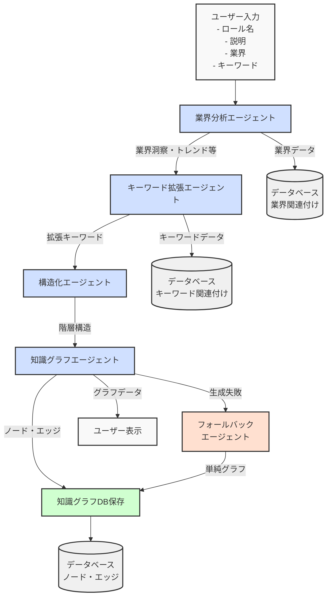
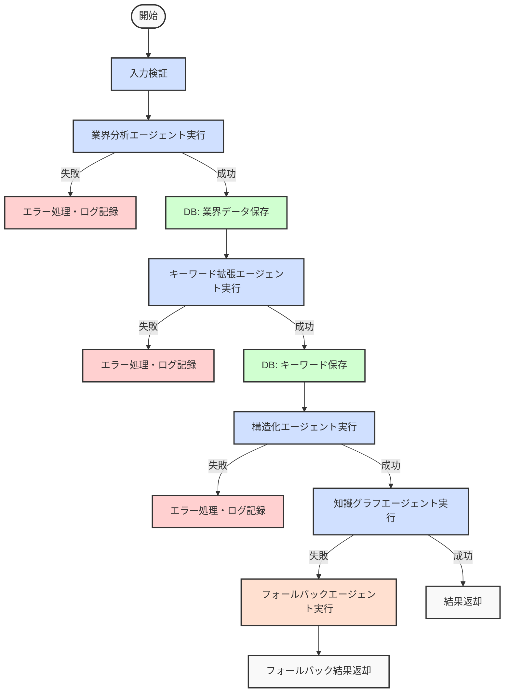

# EVERYS自律型情報収集サービス - マルチAIエージェントアーキテクチャ

このドキュメントでは、EVERYS自律型情報収集サービスで実装されているマルチAIエージェントアーキテクチャの設計と動作フローについて詳細に説明します。

## 1. 全体アーキテクチャ

システム全体は以下のコンポーネントから構成されています：

```mermaid
graph TB
    subgraph "マルチAIエージェントシステム"
        Orchestrator[オーケストレーター\nエージェント] --> SpecializedAgents[特化エージェント\n(複数モジュール)]
        SpecializedAgents <--> AzureOpenAI[Azure OpenAI\nAPI]
        UserInterface[ユーザー\nインターフェース] <--> DB[(データベース\nPostgreSQL)]
        UserInterface --> Orchestrator
        SpecializedAgents <--> DB
    end
    
    style Orchestrator fill:#d0e0ff,stroke:#333,stroke-width:2px
    style SpecializedAgents fill:#d0e0ff,stroke:#333,stroke-width:2px
    style AzureOpenAI fill:#f9f9f9,stroke:#333,stroke-width:2px
    style UserInterface fill:#d0ffd0,stroke:#333,stroke-width:2px
    style DB fill:#f0f0f0,stroke:#333,stroke-width:2px
```

## 2. エージェントの構成

システムは以下の5つの特化エージェントから構成されています：

```mermaid
graph LR
    subgraph "特化エージェントモジュール"
        IndustryAgent[業界分析エージェント\n(Industry Analysis)]
        KeywordAgent[キーワード拡張エージェント\n(Keyword Expansion)]
        StructuringAgent[構造化エージェント\n(Structuring)]
        GraphAgent[知識グラフエージェント\n(Knowledge Graph)]
        FallbackAgent[フォールバックエージェント\n(Fallback)]
    end
    
    style IndustryAgent fill:#d0e0ff,stroke:#333,stroke-width:2px
    style KeywordAgent fill:#d0e0ff,stroke:#333,stroke-width:2px
    style StructuringAgent fill:#d0e0ff,stroke:#333,stroke-width:2px
    style GraphAgent fill:#d0e0ff,stroke:#333,stroke-width:2px
    style FallbackAgent fill:#ffe0d0,stroke:#333,stroke-width:2px
```

### 2.1 各エージェントの役割

1. **業界分析エージェント (Industry Analysis)**
   - 役割: 指定された業界や役割に関する洞察を分析・生成
   - 入力: ロール名、説明、業界、キーワード
   - 出力: 業界洞察、ターゲット対象、トレンド、ビジネスモデル、課題と機会

2. **キーワード拡張エージェント (Keyword Expansion)**
   - 役割: 初期キーワードを元に関連キーワードを拡張・生成
   - 入力: ロール名、説明、業界、キーワード、業界分析結果
   - 出力: 拡張キーワード、キーワード関連度スコア

3. **構造化エージェント (Structuring)**
   - 役割: 分析データとキーワードを階層構造に整理
   - 入力: ロール名、説明、業界分析結果、キーワード拡張結果
   - 出力: 階層化されたカテゴリとサブカテゴリ

4. **知識グラフエージェント (Knowledge Graph)**
   - 役割: 構造化されたデータを視覚的な知識グラフに変換
   - 入力: ロール名、説明、構造化データ、業界・キーワードデータ
   - 出力: ノードとエッジで構成される知識グラフ

5. **フォールバックエージェント (Fallback)**
   - 役割: 他のエージェントが失敗した場合のバックアップ処理
   - 入力: ロール名、説明、業界、キーワード
   - 出力: 単純化された知識グラフ

## 3. データフロー図

データの流れは以下のmermaid図で表現しています：



## 4. 処理フロー詳細

### 4.1 オーケストレーターエージェント処理フロー



### 4.2 知識グラフ生成プロセス

```mermaid
flowchart TD
    Start([開始]) --> GetData[ロールモデルから\n業界・キーワード取得]
    GetData --> SendPrompt[Azure OpenAIに\nプロンプト送信]
    SendPrompt --> ParseJSON[JSONレスポンスパース]
    
    ParseJSON -->|失敗| Fallback[テンプレートグラフ\nフォールバック]
    ParseJSON -->|成功| CreateParent[親ノード作成\n(level 0, 1)]
    
    Fallback --> CreatePredefined[事前定義ノード作成]
    CreatePredefined --> CreateChild
    
    CreateParent --> CreateChild[子ノード作成\n(level 2+)]
    CreateChild --> CreateEdges[エッジ作成]
    CreateEdges --> ReturnResult[結果返却]
    
    style Start fill:#f9f9f9,stroke:#333,stroke-width:2px
    style GetData fill:#d0e0ff,stroke:#333,stroke-width:2px
    style SendPrompt fill:#d0e0ff,stroke:#333,stroke-width:2px
    style ParseJSON fill:#d0e0ff,stroke:#333,stroke-width:2px
    style Fallback fill:#ffe0d0,stroke:#333,stroke-width:2px
    style CreateParent fill:#d0ffd0,stroke:#333,stroke-width:2px
    style CreatePredefined fill:#d0ffd0,stroke:#333,stroke-width:2px
    style CreateChild fill:#d0ffd0,stroke:#333,stroke-width:2px
    style CreateEdges fill:#d0ffd0,stroke:#333,stroke-width:2px
    style ReturnResult fill:#f9f9f9,stroke:#333,stroke-width:2px
```

## 5. エージェント間データ連携

各エージェント間のデータ連携は以下のように実装されています：

### 5.1 データ連携表

| エージェント | 入力 | 出力 | データベース副作用 |
|------------|------|------|----------------|
| 業界分析 | ロール名、説明、業界、キーワード | 業界洞察、ターゲット対象、トレンド、ビジネスモデル、課題と機会 | ロールモデル-業界関連付け |
| キーワード拡張 | ロール名、説明、業界、キーワード、業界分析結果 | 拡張キーワード、関連度スコア | ロールモデル-キーワード関連付け |
| 構造化 | ロール名、説明、業界分析結果、キーワード拡張結果 | 階層化カテゴリ | なし |
| 知識グラフ | ロール名、説明、構造化データ、ロールモデルID | 知識グラフ（ノード、エッジ） | 知識ノード、知識エッジ |
| フォールバック | ロール名、説明、業界、キーワード | 単純知識グラフ | 知識ノード、知識エッジ |

### 5.2 連携フロー詳細

1. **オーケストレーター → 業界分析エージェント**:
   - ユーザー入力（ロール名、説明、業界、キーワード）を受け取りAzure OpenAIへ送信
   - 業界に関する詳細な洞察を生成
   - 分析結果を次のエージェントへ、また業界データをDBに保存

2. **業界分析エージェント → キーワード拡張エージェント**:
   - 業界分析結果と元のユーザー入力を受け取る
   - 業界コンテキストに基づいて関連キーワードを拡張
   - 拡張キーワードリストを次のエージェントへ、またキーワードデータをDBに保存

3. **キーワード拡張エージェント → 構造化エージェント**:
   - 拡張キーワードと業界分析結果を受け取る
   - データを意味のある階層構造に整理
   - 構造化データを知識グラフエージェントへ渡す

4. **構造化エージェント → 知識グラフエージェント**:
   - 構造化データを受け取る
   - DBから業界・キーワードデータを再取得（DB上の最新データを使用）
   - 知識グラフのノードとエッジを生成
   - 知識グラフをDBに保存

## 6. 最近の改善点

### 6.1 データ保存の自動化

1. **業界関連データの自動保存**:
   - 業界分析結果からターゲット、トレンド、ビジネスモデルを抽出
   - 業界名に関連するサブカテゴリをマスタから検索
   - マッチするサブカテゴリをロールモデルと関連付け

2. **キーワード関連データの自動保存**:
   - 拡張キーワードリストを取得
   - 既存キーワードマスタから一致するものを検索
   - 存在しない場合は新規キーワードとして登録
   - キーワードをロールモデルと関連付け

### 6.2 知識グラフの情報収集特化

1. **情報収集用カテゴリ**:
   - レベル1ノードとして以下の5つの情報収集特化カテゴリを設定:
     - 情報収集目的（なぜ情報を集めるのか）
     - 情報源と技術リソース（どこから情報を得るか）
     - 業界専門知識（関連する業界知識）
     - トレンド分析（最新動向の把握方法）
     - 実践応用分野（収集した情報の活用法）

2. **業界・キーワードデータの活用強化**:
   - Azure OpenAIプロンプトに具体的な業界・キーワード情報を含める
   - 役割に関連する具体的なコンテキストを提供
   - より適切な階層構造を生成

### 6.3 実装上の改善

1. **エラーハンドリングの強化**:
   - 各プロセスでのエラー捕捉と適切なフォールバック
   - JSON解析エラーの回避とデータ検証の強化

2. **データベース連携の改善**:
   - ロールモデルIDを利用した適切なデータ関連付け
   - トランザクション処理の改善

3. **視覚化の最適化**:
   - レベル別の階層構造の明確化
   - 情報収集に適した知識グラフのレイアウト調整

## 7. 今後の課題と改善方針

1. **リアルタイム処理の強化**:
   - 知識グラフ生成過程のリアルタイム表示
   - AIエージェントの思考過程の視覚化

2. **データ連携の完全自動化**:
   - 業界・キーワードデータの完全なラウンドトリップ処理
   - 一貫したデータモデルの実装

3. **ユーザーフィードバックの取り込み**:
   - フィードバックループによる知識グラフの継続的改善
   - ユーザー評価に基づくモデル調整

4. **マルチモーダル拡張**:
   - 画像・音声データの取り込み
   - 複合的情報源からの知識抽出

---

*このドキュメントは、EVERYS自律型情報収集サービスのマルチAIエージェントアーキテクチャの現状を記述したものです。システムは継続的に開発・改善されており、新機能や改善点が追加される可能性があります。*